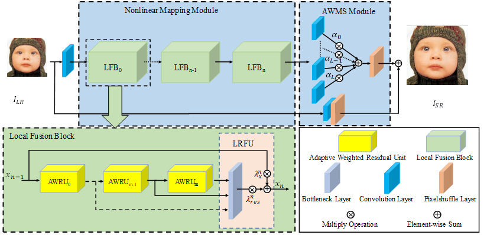
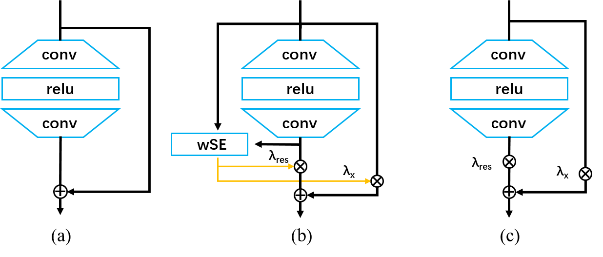
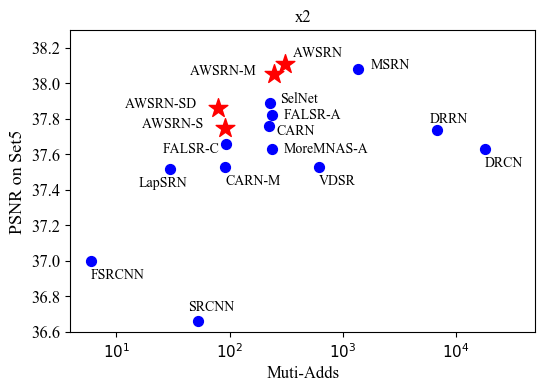
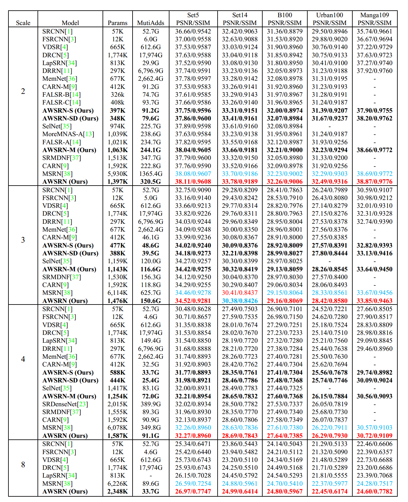
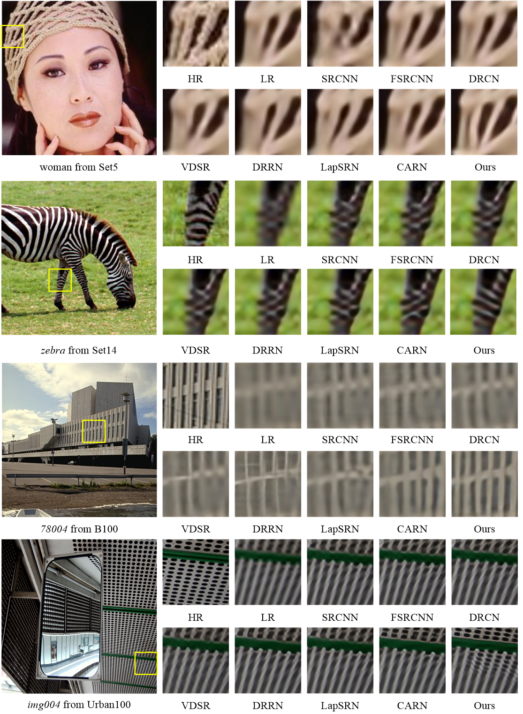

# Lightweight Image Super-Resolution with Adaptive Weighted Learning Network

Chaofeng Wang, Zhen Li and Jun Shi, "Lightweight Image Super-Resolution with Adaptive Weighted Learning Network", [[arXiv]](https://arxiv.org/abs/1904.02358) 

The code is based on [EDSR (PyTorch)](https://github.com/thstkdgus35/EDSR-PyTorch)

## Dependencies

- Python 3.5
- PyTorch >= 0.4.0
- numpy
- skimage
- **imageio**
- matplotlib
- tqdm

## Code

```shell
	git clone git@github.com:ChaofWang/AWSRN.git
	cd AWSRN
```


1. [Abstract](#Abstract)
2. [Architecture](#Architecture)
3. [Data](#Data)
4. [Train](#train)
5. [Test](#test)
6. [Results](#results)
7. [Q&A](#Q&A)
8. [TODO](#TODO)
9. [Citation](#citation)
10. [Acknowledgements](#acknowledgements)

## Abstract

Deep learning has been successfully applied to the single-image super-resolution (SISR) task with great performance in recent years. However, most convolutional neural network based SR models require heavy
computation, which limit their real-world applications. In this work, a lightweight SR network, named Adaptive Weighted Super-Resolution Network (AWSRN), is proposed for SISR to address this issue. A novel local fusion block (LFB) is designed in AWSRN for efficient residual learning, which consists of stacked adaptive weighted residual units (AWRU) and a local residual fusion unit (LRFU). Moreover, an adaptive
weighted multi-scale (AWMS) module is proposed to make full use of features in reconstruction layer. AWMS consists of several different scale convolutions, and the redundancy scale branch can be removed according to the contribution of adaptive weights in AWMS for lightweight network. The experimental results on the commonly used datasets show that the proposed lightweight AWSRN achieves superior performance on ×2, ×3, ×4, and ×8 scale factors to state-of-the-art methods with similar parameters and computational overhead.

## Architecture



​							Network architecture of the proposed AWSRN



​								(a)  [Basic RU](https://arxiv.org/abs/1808.08718v2),  (b) [wRU](https://arxiv.org/abs/1811.06878),  (c) AWRU (Ours)

## Data

all scale factor(x2,x3,x4,x8)  data:

​	training data DIV2K(800 training + 100 validtion images) 

​	benchmark data (Set5, Set14, B100, Urban100, Manga109)

can download from [Google Drive](<https://drive.google.com/drive/folders/1-99XFJs_fvQ2wFdxXrnJFcRRyPJYKN0K>). and extract the data to ./DATA path

## Train

1. Cd to './code/src', run the following commands to train models.

    ```bash
    #=================== AWSRN =================
    #AWSRN x2
    python main.py --model AWSRN --n_resblocks 4 --scale 2  --save AWSRNx2  --epochs 1000 --reset --patch_size 96
    #AWSRN x3
    python main.py --model AWSRN --n_resblocks 4 --scale 3 --save AWSRNx3  --epochs 1000 --reset --patch_size 144
    #AWSRN x4
    python main.py --model AWSRN --n_resblocks 4 --scale 4  --save AWSRNx4  --epochs 1000 --reset --patch_size 192
    #AWSRN x8
    python main.py --model AWSRN --n_resblocks 4 --scale 8  --save AWSRNx8  --epochs 1000 --reset --patch_size 384
    
    #=================== AWSRN-M =================
    #AWSRN-M x2
    python main.py --model AWSRN --n_resblocks 3 --scale 2  --save AWSRN_Mx2  --epochs 1000 --reset --patch_size 96
    #AWSRN-M x3
    python main.py --model AWSRN --n_resblocks 3 --scale 3  --save AWSRN_Mx3  --epochs 1000 --reset --patch_size 144
    #AWSRN-M x4
    python main.py --model AWSRN --n_resblocks 3 --scale 4  --save AWSRN_Mx4  --epochs 1000 --reset --patch_size 192
    
    #=================== AWSRN-S =================
    #AWSRN-S x2
    python main.py --model AWSRN --n_resblocks 1 --scale 2  --save AWSRN_Sx2  --epochs 1000 --reset --patch_size 96
    #AWSRN-S x3
    python main.py --model AWSRN --n_resblocks 1 --scale 3 --save AWSRN_Sx3_retrain  --epochs 1000  --reset --patch_size 144
    #AWSRN-S x4
    python main.py --model AWSRN --n_resblocks 1 --scale 4 --save AWSRN_Sx4  --epochs 1000  --reset --patch_size 192
    
    #=================== AWSRN-SD =================
    #AWSRN-SD x2
    python main.py --model AWSRND --n_resblocks 1 --n_feats 16 --block_feats 128 --scale 2  --save AWSRN_SDx2  --epochs 1000 --reset --patch_size 96 
    #AWSRN-SD x3
    python main.py --model AWSRND --n_resblocks 1 --n_feats 16 --block_feats 128 --scale 3  --save AWSRN_SDx3  --epochs 1000 --reset --patch_size 144 
    #AWSRN-SD x4
    python main.py --model AWSRND --n_resblocks 1 --n_feats 16 --block_feats 128 --scale 4  --save AWSRN_SDx4  --epochs 1000 --reset --patch_size 192 
    ```

## Test

### Quick start
1. Download models and place them in './code/experiment'.

    All the models can be downloaded from [Google Drive](<https://drive.google.com/drive/folders/1R3cqoXU7bstcaNrf76-Tg_AtHPj-JOU2>)

2. Cd to './code/src', run the following commands to get result with paper reported.

    ```bash
    #for examples, test on Set5
    #=================== AWSRN =================
    #AWSRN x2
    python main.py --model AWSRN  --n_resblocks 4 --scale 2  --pre_train ../experiment/AWSRNx2/model/model_latest.pt --save AWSRNx2 --test_only  --dir_data ../../DATA/ --data_test Set5
    #AWSRN x3
    python main.py --model AWSRN  --n_resblocks 4 --scale 3  --pre_train ../experiment/AWSRNx3/model/model_latest.pt --save AWSRNx3 --test_only  --dir_data ../../DATA/ --data_test Set5
    #AWSRN x4
    python main.py --model AWSRN  --n_resblocks 4 --scale 4  --pre_train ../experiment/AWSRNx4/model/model_latest.pt --save AWSRNx4 --test_only  --dir_data ../../DATA/ --data_test Set5
    #AWSRN x8
    python main.py --model AWSRN  --n_resblocks 4 --scale 8  --pre_train ../experiment/AWSRNx8/model/model_latest.pt --save AWSRNx8 --test_only  --dir_data ../../DATA/ --data_test Set5
    
    #=================== AWSRN-M =================
    #AWSRN-M x2
    python main.py --model AWSRN  --n_resblocks 3 --scale 2  --pre_train ../experiment/AWSRN_Mx2/model/model_latest.pt --save AWSRN_Mx2 --test_only  --dir_data ../../DATA/ --data_test Set5
    #AWSRN-M x3
    python main.py --model AWSRN  --n_resblocks 3 --scale 3  --pre_train ../experiment/AWSRN_Mx3/model/model_latest.pt --save AWSRN_Mx3 --test_only  --dir_data ../../DATA/ --data_test Set5
    #AWSRN-M x4
    python main.py --model AWSRN  --n_resblocks 3 --scale 4  --pre_train ../experiment/AWSRN_Mx4/model/model_latest.pt --save AWSRN_Mx4 --test_only  --dir_data ../../DATA/ --data_test Set5
    
    #=================== AWSRN-S =================
    #AWSRN-S x2
    python main.py --model AWSRN  --n_resblocks 1 --scale 2  --pre_train ../experiment/AWSRN_Sx2/model/model_latest.pt --save AWSRN_Sx2 --test_only  --dir_data ../../DATA/ --data_test Set5
    #AWSRN-S x3
    python main.py --model AWSRN --n_resblocks 1 --scale 3  --pre_train ../experiment/AWSRN_Sx3/model/model_latest.pt --save AWSRN_Sx3_retrain --test_only  --dir_data ../../DATA/ --data_test Set5
    #AWSRN-S x4
    python main.py --model AWSRN --n_resblocks 1 --scale 4  --pre_train ../experiment/AWSRN_Sx4/model/model_latest.pt --save AWSRN_Sx4 --test_only  --dir_data ../../DATA/ --data_test Set5
    
    #=================== AWSRN-SD =================
    #AWSRN-SD x2
    python main.py --model AWSRND  --n_resblocks 1 --n_feats 16 --block_feats 128 --scale 2  --pre_train ../experiment/AWSRN_SDx2/model/model_latest.pt --save AWSRN_SDx2 --test_only  --dir_data ../../DATA/ --data_test Set5 
    #AWSRN-SD x3
    python main.py --model AWSRND  --n_resblocks 1 --n_feats 16 --block_feats 128 --scale 3  --pre_train ../experiment/AWSRN_SDx3/model/model_latest.pt --save AWSRN_SDx3 --test_only  --dir_data ../../DATA/ --data_test Set5
    #AWSRN-SD x4
    python main.py --model AWSRND  --n_resblocks 1 --n_feats 16 --block_feats 128 --scale 4  --pre_train ../experiment/AWSRN_SDx4/model/model_latest.pt --save AWSRN_SDx4 --test_only  --dir_data ../../DATA/ --data_test Set5
    
    ```

### NOTE

1. About **AWSRN-S x3** pretrainmodel

    Unfortunately, the pre-training model of AWSRN-S x3 was accidentally deleted by me during the process, so I retrained the model, which may be slightly different from the results reported in the paper.

2. Evaluate PSNR and SSIM.

    if you want to evaluate SSIM for each dataset, you need to save images by appending  '**--save_result**' to test commands.

    Then specify the scale and file name in  'Evaluate_PSNR_SSIM.m' . Run 'Evaluate_PSNR_SSIM.m' to obtain PSNR/SSIM values for paper. 

    In addition, the PSNR results obtained in Python are **the same as** in "Evaluate_PSNR_SSIM.m". So you don't need to run this matlab script in order to verify the value of PSNR.Results

## Results

### Quantitative Results



​							Performance comparison x2 scale on Set5 



For more detail, please refer to our [paper](https://arxiv.org/abs/1807.02758) .
### Visual Results

Visual comparisons over four datasets (Set5, Set14, B100 and Urban100) for ×4 scale



## TODO

1. ~~Provide our results on benchmark dataset~~

   Our all models results can download [Baidu Cloud](https://pan.baidu.com/s/16R5kPtLyv-pOVzOcb5_aKQ)  code: h39w or [Google Drive](https://drive.google.com/drive/folders/1FGMNWsgj6gSlrWeXqfYNfSR9nC7sUMVT)

2. Train deeper AWRNs with more parameters

3. TBA...

## Q&A

1. Q: why have three AWSRN model files in “./src/model” ?

   A: The two files "awsrn.py" and "awsrnd.py" are due to the unclean code styles in my exploration research process. Since the results in the paper are the two model files, they are published. And "awsrnv2.py" is a unified version, you can use this version if you want to retrain all AWSRN models.

## Citation

If you find the code helpful in your resarch or work, please cite the following papers.
```
@article{wang2019lightweight,
  title={Lightweight Image Super-Resolution with Adaptive Weighted Learning Network},
  author={Wang, Chaofeng and Li, Zhen and Shi, Jun},
  journal={arXiv preprint arXiv:1904.02358},
  year={2019
}
```
## Acknowledgements

This code is built on [EDSR (PyTorch)](https://github.com/thstkdgus35/EDSR-PyTorch). We thank the authors for sharing their codes of EDSR  [PyTorch version](https://github.com/thstkdgus35/EDSR-PyTorch).

We also refer to some other work:

[wdsr_ntire2018(PyTorch)](https://github.com/JiahuiYu/wdsr_ntire2018)

[RCAN (PyTorch)](https://github.com/yulunzhang/RCAN)

[CARN (PyTorch)](https://github.com/nmhkahn/CARN-pytorch)
